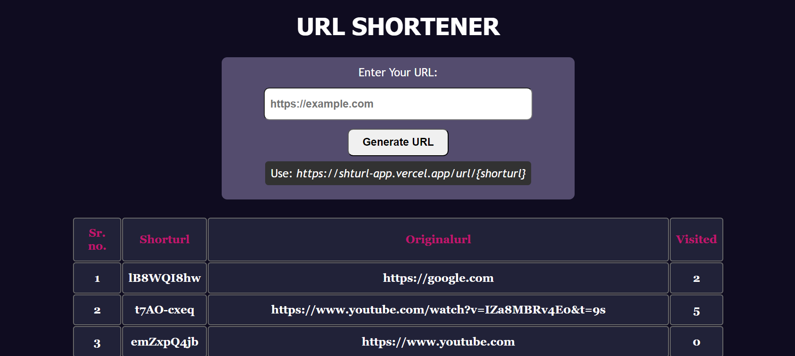

# URL Shortener

URL Shortener is a simple web app that allows you to create short and memorable urls from long and complex ones. It is built with Node.js, Express.js, MongoDB, and ejs.

## Screenshort

## Preview Link
[URL SHORTENER (Click Me!! 👆)](https://shturl-app.vercel.app)

## Installation

To install and run URL Shortener, you need to have Node.js, Express.js, MongoDB, and ejs installed on your system. You can follow these steps:

- Clone this repository to your local machine: `git clone https://github.com/Abhilash-03/url-shortener.git`
- Navigate to the project directory: `cd url-shortener`
- Install the required dependencies: `npm install`
- Start the server: `npm start`
- Open your browser and go to `http://localhost:3000`

## Usage

To use URL Shortener, you can follow these steps:

- Enter a valid url in the input box. For example: `https://www.google.com/search?q=url+shortener`
- Click on the generate short url button. A shortened url will be displayed below the input box. For example: `http://localhost:3000/4fj3k`
- Copy the shortened url and use it anywhere you want. The shortened url will redirect you to the original url when you visit it.

## Contributing

URL Shortener is an open source project and welcomes contributions from anyone. If you want to contribute to this project, you can:

- Fork this repository and create a new branch for your feature or bug fix.
- Make your changes and commit them with a clear and descriptive message.
- Push your branch to your forked repository and create a pull request to the main branch.
- Wait for your pull request to be reviewed and merged.

## `Happy Coding 🚀👨‍💻🔥😎 !!! `